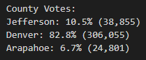

# Election_Analysis
## Project Overview
Analysis done for a Board of Elections employee who needed to complete an election audit of a congressional election. The analysis was done by completing the following tasks:
1. Calculate the total number of votes cast.
2. Get a complete list of candidates who received votes.
3. Calculate the total number of votes each candidate received.
4. Calculate the porcentage of votes each candidate won.
5. Determine the winner of the election based on popular vote.
6. Determine the voter turnout for each county.
7. Calculate the percentage of votes from each county.
8. Determine the county with teh highest turnout.

## Resources
- Data source: election_results.csv
- Software: Python 3.8.8, Visual Studio Code 1.62.2

## Summary
The analysis of the election show that:
- There were 369,711 votes cast in the election.
- The candidates were:

