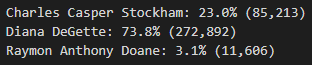
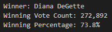

# Election_Analysis
## Project Overview
Analysis done for a Board of Elections employee who needed to complete an election audit of a congressional election. The analysis was done by completing the following tasks:
1. Calculate the total number of votes cast.
2. Get a complete list of candidates who received votes.
3. Calculate the total number of votes each candidate received.
4. Calculate the percentage of votes each candidate won.
5. Determine the winner of the election based on popular vote.
6. Determine the voter turnout for each county.
7. Calculate the percentage of votes from each county.
8. Determine the county with the highest turnout.

## Resources
- Data source: election_results.csv
- Software: Python 3.8.8, Visual Studio Code 1.62.2

## Summary
The analysis of the election show that:
- There were 369,711 votes cast in the election.
- The voters’ turnout for each county were:

  - There were 38,855 votes in Jefferson which represented the 10.5% of the total count.
  - Arapahoe county had the lowest voters’ turnout with only 24,801 votes that represent the 6.7% of the total count. 
  - Denver had the highest participation with the 82.8% of the total count which is the equivalent of 306,055 votes.

&nbsp;&nbsp;&nbsp;&nbsp;&nbsp;&nbsp;&nbsp;&nbsp;&nbsp;&nbsp;&nbsp;&nbsp;&nbsp;

- The candidates results were:

  - Charles Casper Stockham won the 23.0% of the total count getting a total of 85,213 votes.
  - Diana DeGette on the other hand, received 272,892 votes that represent the 73.8% of the total count.
  - Raymon Anthony Doane was the candidate with the least number of votes (11,606) for a 3.1% of the total count.

&nbsp;&nbsp;&nbsp;&nbsp;&nbsp;&nbsp;&nbsp;&nbsp;&nbsp;&nbsp;&nbsp;&nbsp;&nbsp;

- The election winner:

  - Diana DeGette won a comfortable victory in the elections, defeating the other candidates by a high margin.

&nbsp;&nbsp;&nbsp;&nbsp;&nbsp;&nbsp;&nbsp;&nbsp;&nbsp;&nbsp;&nbsp;&nbsp;&nbsp;

## Recommendations

- The script provides a solution to extract and analyze data from a CSV file and creates a TXT file that displays the election results divided in three categories: County results, candidates results and winner. However, the script can be modified to get even more information for any election that requires more analysis. In other words, you could add lists that hold the candidate results per region and then create conditionals to track the number of votes per candidate in a specific region. E.g., for this analysis we could have seen who got the most votes in each county. Another modification could be having lists and dictionaries that contain hierarchy of regions i.e., being able to analyze the results by State or city level, this would be ideal for much larger elections because you could analyze who won by different geographic levels.
